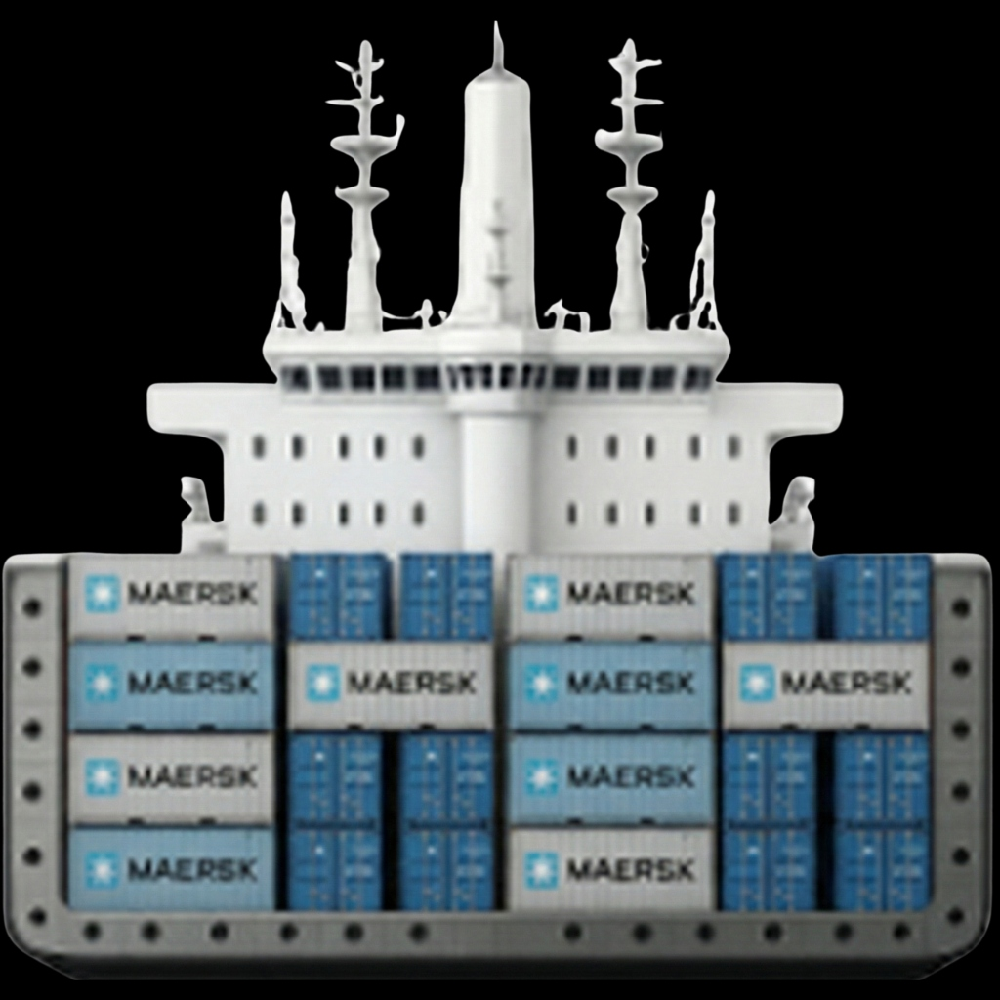

# Port Crane Monitoring System (EMS) 🏗️🚢

A comprehensive digital twin and monitoring dashboard for industrial port cranes, featuring real-time telemetry, historical playback, and simulation modes for both Bulk and Container handling scenarios.



## 🌟 Features

*   **Real-time Monitoring**: Visualization of crane telemetry (Angle, Radius, Height, Load, etc.).
*   **3 Operation Modes**:
    *   **Live**: Real-time data feed (via MQTT/Socket.io).
    *   **History**: Playback of past operations with time-travel controls (Speed, Skip, Slider).
    *   **Simulation**: Physics-based simulation of crane movements for testing and demo purposes.
*   **Dual Scenarios**:
    *   **🏗️ Bulk Handling**: Visualization with Bulk Carrier and Motor Grabber.
    *   **🚢 Container Handling**: Visualization with Container Ship and Spreader (Empty/Loaded).
*   **Advanced Visualization**:
    *   Side-view digital twin with animated boom, hoist, and slew.
    *   Top-down radar view.
    *   Dynamic day/night cycle and weather effects.
    *   Interactive gauges and status indicators.

## 🛠️ Tech Stack

*   **Frontend**: React, Vite, TailwindCSS
*   **Backend**: Node.js, Express, Socket.io
*   **Icons**: Lucide React
*   **Data**: Mock telemetry generator + Historical data API

## 🚀 Getting Started

### Prerequisites

*   Node.js (v14+ recommended)
*   npm or yarn

### Installation

1.  Clone the repository:
    ```bash
    git clone https://github.com/yourusername/port-crane-monitoring.git
    cd port-crane-monitoring
    ```

2.  Install dependencies:
    ```bash
    npm install
    # Install backend dependencies if separate
    cd server
    npm install
    cd ..
    ```

### Running the Application

1.  **Start the Backend Server** (Terminal 1):
    ```bash
    cd server
    npm start
    ```
    *Server runs on port 3000.*

2.  **Start the Frontend** (Terminal 2):
    ```bash
    npm run dev
    ```
    *Client runs on http://localhost:5173*.

## 📂 Project Structure

*   `src/pages/EquipmentMonitoring.jsx` - Main dashboard component containing visualization logic.
*   `src/hooks/useHistory.js` - Hook for managing historical data fetching.
*   `src/data/telemetryData.js` - Mock data and configuration constants.
*   `server/index.js` - Express/Socket.io backend.

## 🎮 Controls

*   **Mode Switch**: Toggle between Live, History, and Sim in the top header.
*   **Scenario Switch**: Toggle between Bulk and Container visualization.
*   **Playback**: Use the timeline slider, play/pause, and speed controls in History/Sim mode.

## 📝 License

This project is licensed under the MIT License.
